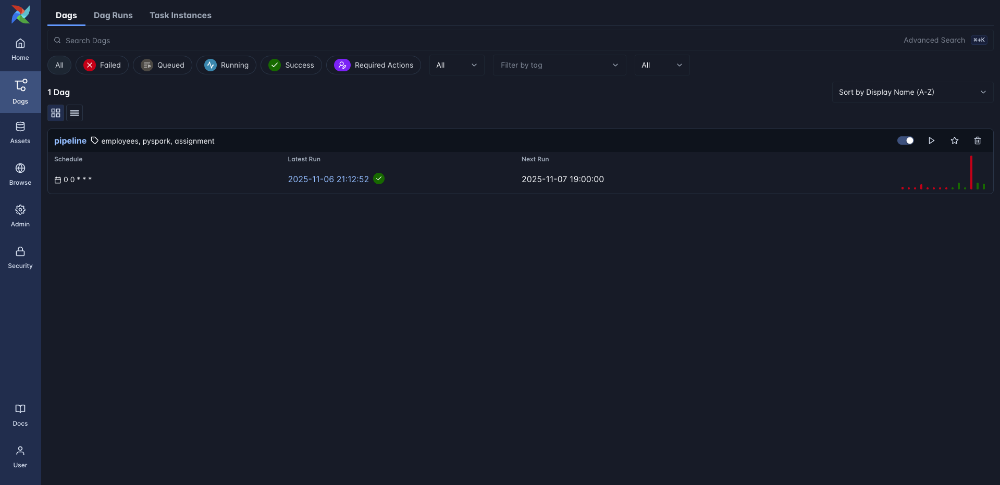
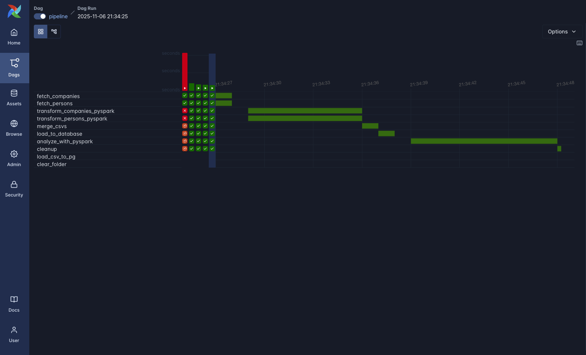
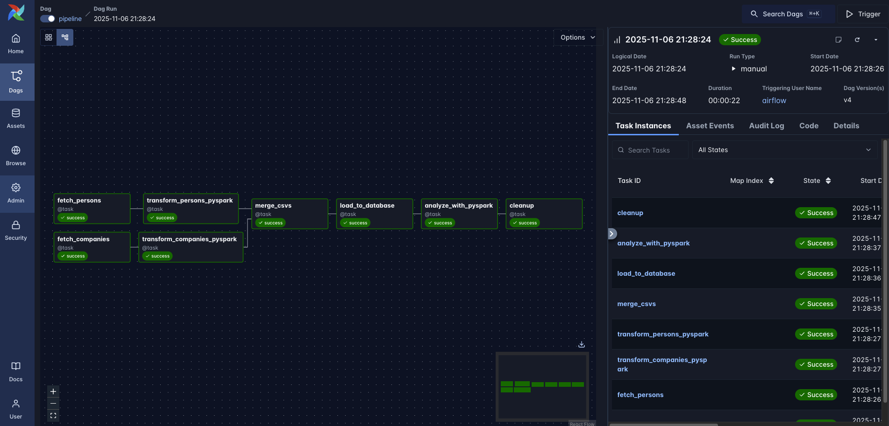
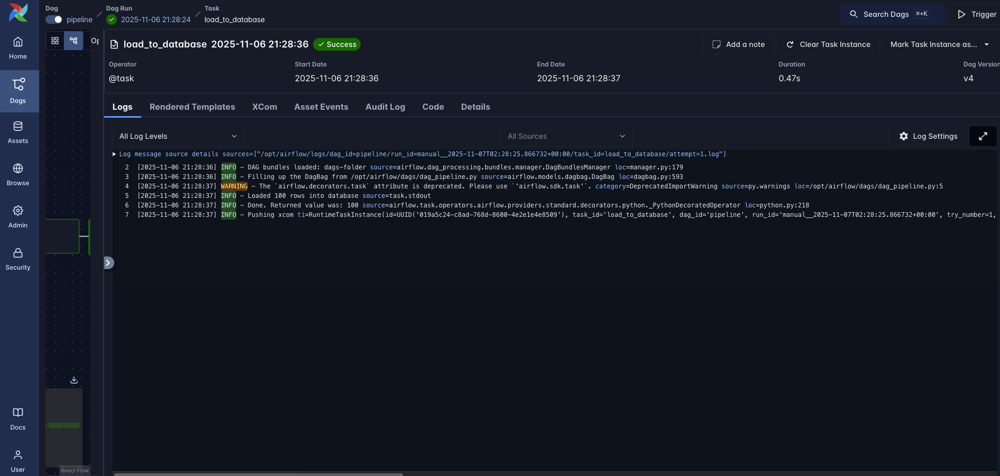
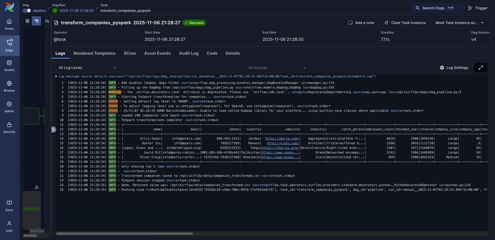
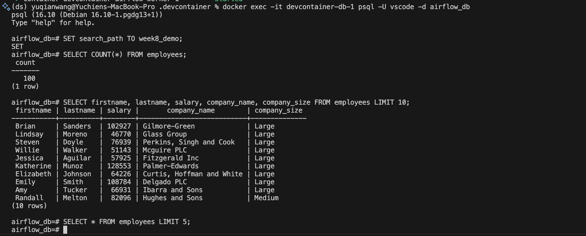
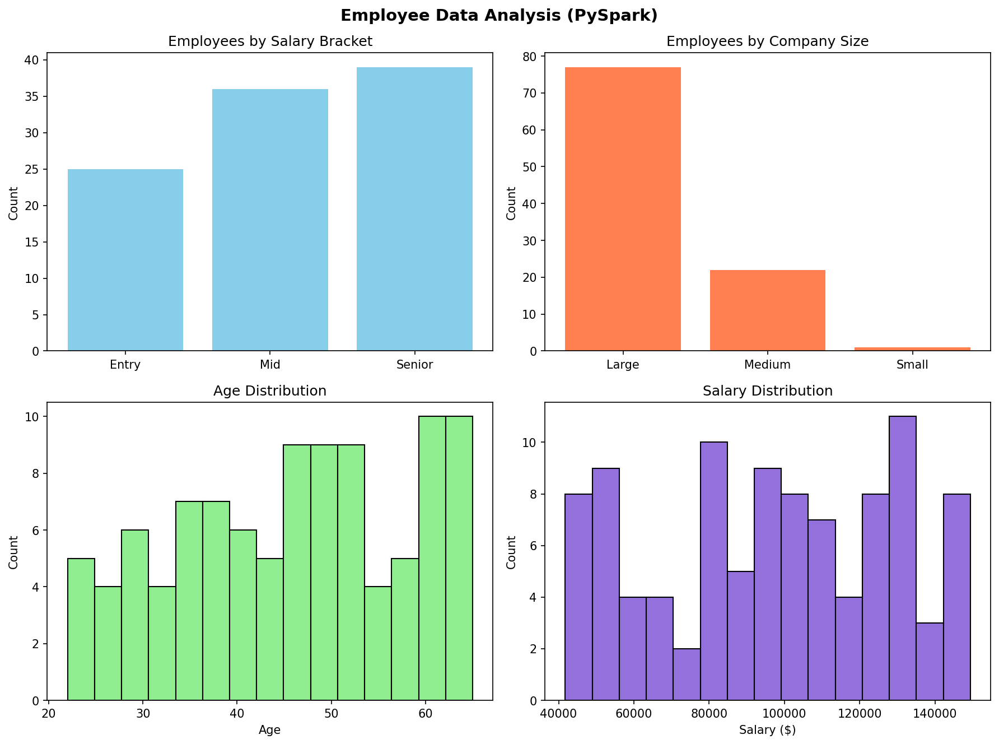

# IDS706_Week10_Airflow
## Airflow Employee and Company Pipeline

## What It Does
1. Generates 100 employee profiles and 100 company records
2. Transforms data using PySpark (age groups, salary brackets, company sizes)
3. Merges employee and company datasets
4. Loads into PostgreSQL database
5. Analyzes with PySpark and creates visualizations
6. Cleans up temporary files

## How the Pipeline Works
**Step 1: Generate Data**  
Creates fake employee data and company data using Faker library.

**Step 2: Transform with PySpark (Parallel)**  
- **Employees**: Creates full names, extracts email domains, categorizes ages and classifies salaries 
- **Companies**: Categorizes company size, calculates company age, classifies revenue, standardizes industry names

**Step 3: Merge**  
Combines employee information with company information to create complete employee records.

**Step 4: Load to Database**  
Stores 100 merged employee-company records in PostgreSQL.

**Step 5: Analyze with PySpark** 
Uses Spark to aggregate employee counts by salary bracket and company size, then creates a 4-chart visualization:
- Employees by salary bracket
- Employees by company size  
- Age distribution histogram
- Salary distribution histogram

**Step 6: Cleanup**  
Removes temporary CSV files

## Requirements
- Apache Airflow 3.1.0
- PostgreSQL 16
- PySpark 3.5.0 (for distributed processing)
- Docker
- Python (Pandas, Matplotlib, Faker)

## Setup
```bash
# Clone repo
git clone https://github.com/04795t/IDS706_DE_WK10.git](https://github.com/yuqianw2002/ids706_airflow_hw
cd airflow-data-pipeline

# Build and start
cd .devcontainer
docker compose build
docker compose up -d

# Access: http://localhost:8080
# Login: airflow / airflow
```

**Configure Postgres Connection:**
- Go to Admin -> Connections -> Add
- Connection ID: `Postgres`
- Type: `postgres`
- Host: `host.docker.internal`
- Database: `airflow_db`
- Login: `vscode`
- Password: `vscode`
- Port: `5432`

## PySpark
PySpark is scalable to big data, and allows for distributed processing. 

## Results
- 100 employee records loaded to PostgreSQL
- 8 PySpark transformations applied (4 per dataset)
- Employee distribution analyzed by salary and company size
- Pipeline runs in ~60 seconds
- Chart save in `data` file, name as `analysis_chart.png`

## Screenshots
### DAG Execution


### Successful Execution


### Graph


### Log


### PySpark Log


### Database Results


### Analysis of emplyee

